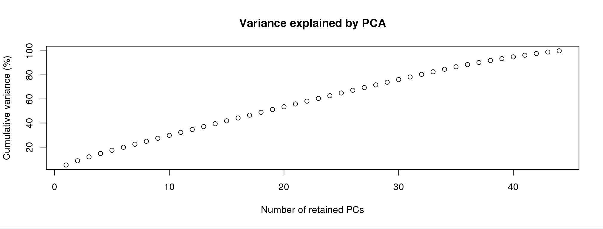
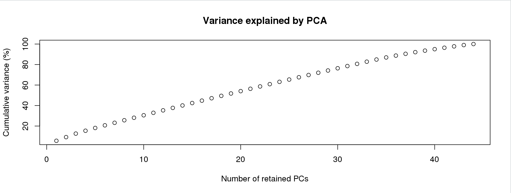

```{r setup, include=FALSE}
knitr::opts_chunk$set(echo = TRUE)
```

# PCA

One important consideration is that we need to deal with linkage in our data set. We will use PCAdapt to help us with this and to illustrate why.

## Load data
First, we load in the data and convert our previous `array.bed` file to pcadapt input
```{r}
library(pcadapt)
filename <- read.pcadapt("../Processed_Data/array.bed", type = "bed")

```

## Examine the PCs
First, we can start with a regular PCA.  The first line of code below calculates the PCA with 5 PCs and the second line plots the amount of variance that each PC explains.

```{r}
res <- pcadapt(filename, K = 5)
plot(res, option = "screeplot")
```

For this analysis, the idea number of PCs is the one before the variance stars plateauing.  Essentially, we're looking for the "elbow."  Here, this would be 2.

Let's plot the PCA.  First, we need to recreate the list of population assignments.  We'll do this the same way as the last section.


```{r, warning=FALSE}
table <- read.table("../Example_Data/strata", header = TRUE)
poplist.names <- table$Population

plot(res, option = "scores", pop = poplist.names)
```

This might look normal, but you'll notice that two of the populations are tightly grouped around PC1.  We should check too make sure this pattern isn't being driven by a linkage in the genome.  To do this, we can look at the loading scores of the PCs.  Loading scores show how much a particular SNP factors into a PC. 


```{r}
par(mfrow = c(2, 2))
for (i in 1:4)
  plot(res$loadings[, i], pch = 19, cex = .3, ylab = paste0("Loadings PC", i))
```
These values should be evenly distributed across the genome.  You'll notice that PC1 has a bit of a pattern to it.  Let's zoom in.


```{r}
plot(res$loadings[, 1], pch = 19, cex = .3, ylab = paste0("Loadings PC", i))

```
Now, you can definitely see a weird pattern between Index 30,000 and 40,000.  This is from several large genomic inversion in the oyster genome.  All of those SNPs are highly linked and are driving a large porition of our PCA.

## Dealing with linkage using LD clumping

Linkage Disequilibrium can affect ascertainment of population structure ([Abdellaoui et al. 2013](https://www.nature.com/articles/ejhg201348)).  Users analyzing dense data such as SNP Array data should account for LD in their PCAs and PCA-based genome-scans.

Thankfully, PCAdapt has a built in feature that allows us to clump SNPs by LD, basically reducing the data to a more informative subset.
```{r}
res <- pcadapt(filename, K = 10, LD.clumping = list(size = 500, thr = 0.2))
plot(res, option = "screeplot")
```

This changed a bit, and we now have possibly 4 informative PCs.  Let's take a look at the loadings:


```{r}
res <- pcadapt(filename, K = 4, LD.clumping = list(size = 500, thr = 0.2))
par(mfrow = c(2, 2))
for (i in 1:4)
  plot(res$loadings[, i], pch = 19, cex = .3, ylab = paste0("Loadings PC", i))
```
Great!  Now, we no longer see strong patterns in the loading scores.  We can proceed.

```{r, warning = FALSE}
plot(res, option = "scores", pop = poplist.names)
```
Now, we can see there is much more separation in PopA vs PopB than there was before.  


## Filter data for PCA and DAPC

PCAdapt is great for filtering and for looking for loci under selection (not covered in this tutorial), but there are other packages that are a little more handy for calculating and plotting PCAs and DAPCE.  We can filter our VCF to only the post-clumped loci (those with less LD).

First, we will reload our VCF file into R in case you're starting from scratch, but we made this in the previous tutorial:

```{r}
library(vcfR)
my_vcf <- read.vcfR("../Processed_Data/array.vcf")
```

```{r}
ld_filtered_vcf <- my_vcf[!is.na(res$loadings[,1]),]
```


Next, we will convert our vcfR file to a genlight input which can be used by the package adegenet.  We will also use the `strata` and `setPop` function to enter population level information.  Remember, we made the strata_df in the previous tutorial, but we will remake it here just in case.
```{r}
library(adegenet)
mygl <- vcfR2genlight(ld_filtered_vcf,n.cores =2)

strata<- read.table("../Example_Data/strata", header=TRUE)
strata_df <- data.frame(strata)

strata(mygl) <- strata_df
setPop(mygl) <- ~Population
```


Below, we use the PCA function of adegent to create a PCA.
```{r}
oyster.pca <- glPca(mygl, nf = 3)

```

Let's look at how much variance each PC explains:
```{r}
barplot(100*oyster.pca$eig/sum(oyster.pca$eig), col = heat.colors(50), main="PCA Variance Explained")
title(ylab="Percent of variance\nexplained", line = 2)
title(xlab="PC", line = 1)

```
We basically have three informative PCs here.  Let's plot the individuals on the first two PCs:

```{r}

myCol <- colorplot(oyster.pca$scores,oyster.pca$scores, transp=TRUE, cex=4)
abline(h=0,v=0, col="grey")
add.scatter.eig(oyster.pca$eig[1:10],2,1,2, posi="bottomright", ratio=.16)
```
The plot above is combining information from the first 3 PCs to color dots, and using the first two for x,y coordinates.  We can see possibly four groups across all PCs.


We can also port this to ggplot and color by population:

```{r}
library(ggplot2)
oyster.pca.df <- as.data.frame(oyster.pca$scores)
oyster.pca.df$pop <- pop(mygl)
cols <-c("#871a1a","#33A02C","#1F78B4")

p <- ggplot(oyster.pca.df, aes(x=PC1, y=PC2, colour=pop)) 
p <- p + geom_point(size=2)
p <- p + stat_ellipse(level = 0.95, size = 1)
p <- p + scale_color_manual(values = cols) 
p <- p + geom_hline(yintercept = 0) 
p <- p + geom_vline(xintercept = 0) 
p <- p + theme_bw()

p
```

So, we can see that we have some subtle structuring within PopC.

# DAPC

Discriminant analysis of Principal Components (DAPC), allows us to either infer groups or put in groups *a priori*.  DAPC seeks to maximize between group variance while minimizing within group variance.  I'll show you how this works both ways below.  

## DAPC with inferred groups

### Finding clusters

Adegenet has a built in method for inferring population groupings or clusters.  It runs interactively, so this code block below won't run on it's own.  You need to paste it into the Console.  

```{r, eval=FALSE}
grp <- find.clusters(mygl, max.n.clust=10)
```

I'm going to simulate this experience below:

First, you will see a screen like this:

For the purpose of picking clusters, the more PCs the better.  Pick any number greater than 40.

Next screen will be:


We'd like to see an elbow here, where the lowest point would be the correct number.  This doesn't always work well for subtle structure.  I'm going to pick 4 given the results above.

```{r, echo =FALSE}
grp <- find.clusters(mygl, max.n.clust=10, n.pca =100, n.clust =4)
```


We can make a simple table to see the assignments:
```{r}
table(pop(mygl), grp$grp)
```
This makes sense given our PCA.  Let's run the DAPC.

### Discriminant Analysis

This is another interactive function.  Run in the console.
```{r, eval=FALSE}
oyster.dapc <- dapc(mygl, grp$grp)
```
Again, I simulate this experience below. First screen is:


**Now this is different than finding clusters.  You can overload the analysis with two many PCs.**  For this, you want to choose the lowes number that gets you > 60% of the variance.  I would choose 25 or 30.

After you enter the number of PCs, you'll see something like this:


This is picking the number of discriminant functions.  Because we put in four groups, there are only three.  Truly, only the first two are informative.  Let's pick 2.


```{r, echo = FALSE}
oyster.dapc <- dapc(mygl, n.pca = 25, n.da = 2, grp$grp)
```

Now, let's plot the analysis
```{r}
scatter(oyster.dapc,col=cols,bg="white", solid=1)
```

We can also plot membership probabilities:
```{r}
compoplot(oyster.dapc, posi="bottom",txt.leg=paste("Cluster", 1:4), lab="", ncol=4, xlab="individuals")
```
We can use ggplot to make this easier to read and put in the populations for each individual:

```{r}
library(tidyr)
dapc.df <- as.data.frame(oyster.dapc$posterior)
dapc.df$pop <- pop(mygl)
dapc.df$indNames <- rownames(dapc.df)
cols4 <-c("#871a1a","#33A02C","#1F78B4","#FDBF6F" )

dapc.df <- pivot_longer(dapc.df, -c(pop, indNames))
colnames(dapc.df) <- c("Original_Pop","Sample","Assigned_Pop","Posterior_membership_probability")

p <- ggplot(dapc.df, aes(x=Sample, y=Posterior_membership_probability, fill=Assigned_Pop))
p <- p + geom_bar(stat='identity') 
p <- p + scale_fill_manual(values = cols4) 
p <- p + facet_grid(~Original_Pop, scales = "free")
p <- p + theme(axis.text.x = element_text(angle = 90, hjust = 1, size = 8))
p <- p + ylab("Posterior membership probability")
p
```

## DAPC with original populations
Again, instead of inferring groups, we can use our original populations.

```{r}
oyster.dapc <- dapc(mygl, n.pca = 25, n.da = 2)
scatter(oyster.dapc, col = cols, cex = 2, legend = TRUE, clabel = F, posi.leg = "bottomleft", scree.pca = TRUE,
        posi.pca = "topleft", cleg = 0.75, posi.da = "topright")
```

Let's make this better with ggplot
```{r}
dapc.df <- as.data.frame(oyster.dapc$ind.coord)
dapc.df$pop <- pop(mygl)
dapc.df$indNames <- rownames(dapc.df)

p <- ggplot(dapc.df, aes(x=LD1, y=LD2, colour=pop)) 
p <- p + geom_point(size=2)
p <- p + scale_color_manual(values = cols) 
p <- p + geom_hline(yintercept = 0) 
p <- p + geom_vline(xintercept = 0) 
p <- p + theme_bw()+ xlab("DA 1") + ylab("DA 2")+ ggtitle("DAPC with populations as groups")

p


```

# Works cited and acknowledgements
Code for this tutorial was adapted from the following sources:

1. <https://knausb.github.io/vcfR_documentation/>
2. <https://grunwaldlab.github.io/Population_Genetics_in_R/gbs_analysis.html>
3. Documentation from the [Adegenet R Package](https://github.com/thibautjombart/adegenet)


