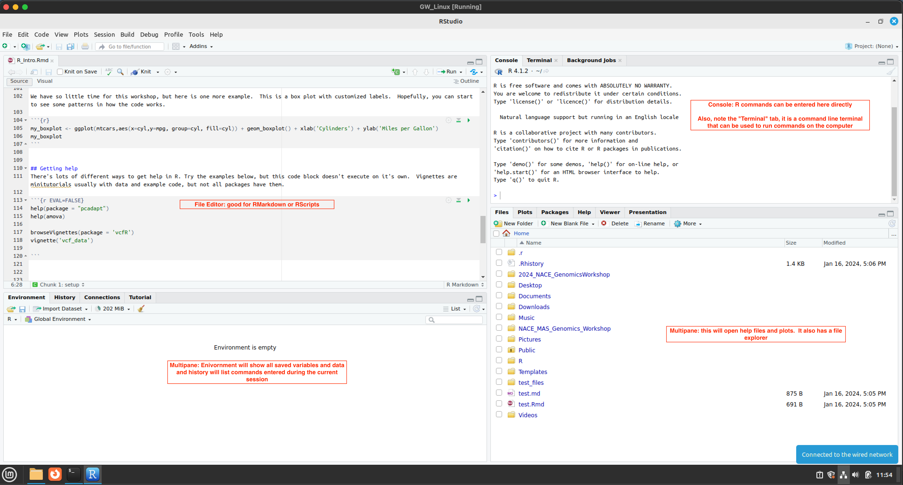

```{r setup, include=FALSE}
knitr::opts_chunk$set(echo = TRUE)
```

# Intro to R
R is a statistical programming language that allows users to do advanced computational analysis.  It can store a variety of different data types and then perform computation on them.

Here, we can assign `x` a value of 5 with:

```{r}
x<- 5
```

We can then ask R to recall that value

```{r}
x
```

We can make this more complicated

```{r}
x <- 5 + 5
x
```

```{r}
x <- 5
y <- x + 5
y
```

R can also store vectors (or a list) of variables.  They can be various types: numbers, characters, etc.


```{r}
vector_a <- c(1,2,3,4,5)
vector_b <- c("a","b", "c")
```


We can also use R to access specific values of that array (or list)
```{r}
vector_a[1]
vector_b[2]
```


This can be expanded to tables or data frames.  R has some example data that's loaded by default.  One is the `cars` data set

```{r}
summary(cars)
```
The function `summary` summarizes the data table for us.  We can see there are two columns.  We can sample a particular column or row with the index of the table or data frame.  For example:

```{r}
summary(cars[,1])
```

You'll notice these values are the same for `speed` in the output above.  This is because we only gave the function the first column of `cars`

We can also subset it using the name of the column

```{r}
summary(cars$speed)
```

Again, we get the same answer.  Instead of summarizing, we can also print the first 10 lines with the function `head`

```{r}
head(cars)
```


## Packages and loading them
R also allows programmers to develop and distribute packages which allow reproducible research in nearly any field.  We load a package (or also called a library) with the command `library`

```{r}
library(ggplot2)
```

Now we can use the functions that are part of the package!  We could spend a whole semester on ggplot, but this package is widely used for plotting data.  Here, I'm going to take advantage of more example data: `mtcars` which has much more data than `cars`

```{r}
summary(mtcars)
```

```{r}
my_scatplot <- ggplot(mtcars,aes(x=wt,y=mpg,col=cyl)) + geom_point()
my_scatplot
```

Here, we are using ggplot to make a scatter plot.  The first command `ggplot` sets the framework of the plot with a subcommand `aes` which is short for aethetics.  This command tells ggplot to set the variable `wt` in `mtcars` as the x variable, `mgp` as the y variable, and `cyl` as a variable for coloring.  

We can do so much more, like customizing lablels by simply "adding" to the plot variable `my_scatplot`

```{r}
my_scatplot + labs(x='Weight (x1000lbs)',y='MPG',colour='Number of\n Cylinders')
```

We have so little time for this workshop, but here is one more example.  This is a box plot with customized labels.  Hopefully, you can start to see some patterns in how the code works.

```{r}
my_boxplot <- ggplot(mtcars,aes(x=cyl,y=mpg, group=cyl, fill=cyl)) + geom_boxplot() + xlab('Cylinders') + ylab('Miles per Gallon')
my_boxplot 
```


## Getting help
There's lots of different ways to get help in R. Try the examples below, but this code block doesn't execute on it's own.  Vignettes are minitutorials usually with data and example code, but not all packages have them.

```{r, eval=F, echo=T}
help(package = "pcadapt")
help(amova)     

browseVignettes(package = 'vcfR')
vignette('vcf_data')

```


## RStudio
This intro was done live and is difficult to reproduce, but here's an annotated image:



## RMarkdown

This is an R Markdown document. Markdown is a simple formatting syntax for authoring HTML, PDF, and MS Word documents. It also can be used to render a `markdown` file (`.md`) that is suitable for publishing directly on Github.  For more details on using R Markdown see http://rmarkdown.rstudio.com.

When you click the **Knit** button a document will be generated that includes both content as well as the output of any embedded R code chunks within the document.

## Including Code

You can include R code in the document as follows:

```{r cars}
summary(cars)
```

## Including Plots

You can also embed plots, for example:

```{r pressure, echo=FALSE}
plot(pressure)
```

Note that the `echo = FALSE` parameter was added to the code chunk to prevent printing of the R code that generated the plot.

## Running commands outside of R
RStudio and RMarkdown allow you to run commands through a system terminal.  This means we can embed `BASH` code to run on the machine

```{bash}
echo "Hi, I'm a BASH code output"
```

```{bash}
echo -e "The Current Directory is $(pwd)"
```
